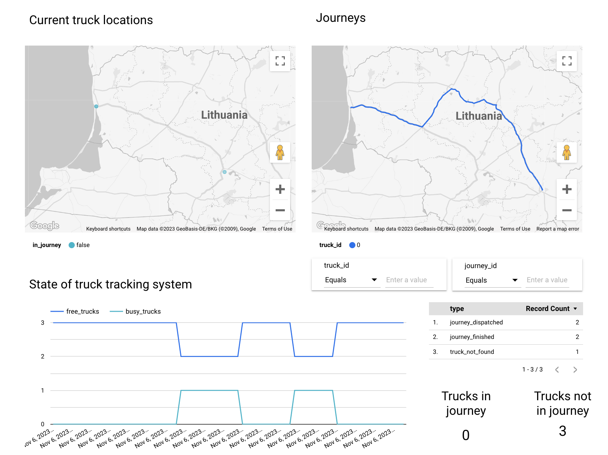

# Simulation of Truck Tracking System

## Description of the flow

1. Customer sends an delivery request event
2. The tracking system finds the appropriate truck that can handle the specified weight load
3. Truck starts a journey, the system emits events that contain tracks' locations and other important domain events
4. Developer/Stakeholder can see the actual state of the system in the report

## Services used

1. **GCP Pub/Sub** - accepts the events that are published by trucks and TTS
2. **GCP BigQuery** - gathers the data from Pub/Sub, contains view that are used by the report
3. **Google Maps, Google Routes** - used by TTS to get the routes and locations
4. **Google Looker Studio** - used to create a report to show the relevant system metrics
5. **GCP Cloud Run** - hosts the TTS api and notifications api
6. **GCP Secret Manager** - used to store secret values that are used by services
7. **GCP IAM** - used to define service accounts
8. **Telegram API** - used for notifications for important TTS logs

## Taxonomy

`TTS`: Truck Tracking System that handles and dispatches operations

`Truck`: instance of the truck that can carry out the delivery, has id, color, location

`Fleet`: represents a set of `Trucks`

`Event`: event from the customer, that system should process

`Journey`: instance of the journey, that is linked to `Truck` and `Route` and has a progress attribute

`Route`: info about the route that the `Truck` will move on during the `Journey`

## Tasks

- [x] Implement the handling of the delivery request event
- [x] Log other events to the BigQuery table, for further analysis
  - [x] Add log for journey dispatched event
  - [x] Add log for journey finished event
  - [x] Add log for TTS state event
- [x] From domain logs table create view for each domain log type
  - [x] Logs for journey dispatched logs
  - [x] Logs for journey finished logs
  - [x] Logs for tts state logs
- [x] Add the ability to populate events from endpoints
- [x] Add service or use some GCP capabilities to get the analytics from the BigQuery data (plots, etc.)
  - [x] Create a dashboard that shows the current location of all Trucks
  - [x] Create a counter that shows the number of free trucks
  - [x] Create a counter that shows the number of busy trucks
  - [x] Create a dashboard that shows the current location and journey for a specific truck
  - [x] Create a table that shows the number of important domain logs
- [x] Describe the infrastructure with Terraform
  - [x] Describe pub sub resources
  - [x] Describe big query resources
- [x] Implement the selection of appropriate truck based on the weight of delivery request
  - [x] Add event if no truck with appropriate load capabilities was found
- [x] Add a script to automatically trigger delivery requests
- [x] Add email/messenger notifications, when some logs occur
- [x] Run the simulation on cloud run instance

## Links

- [Trucks data report](https://lookerstudio.google.com/u/0/reporting/b65afff4-a83d-405b-bdfe-19ade39b8cc9/page/rOtgD)
